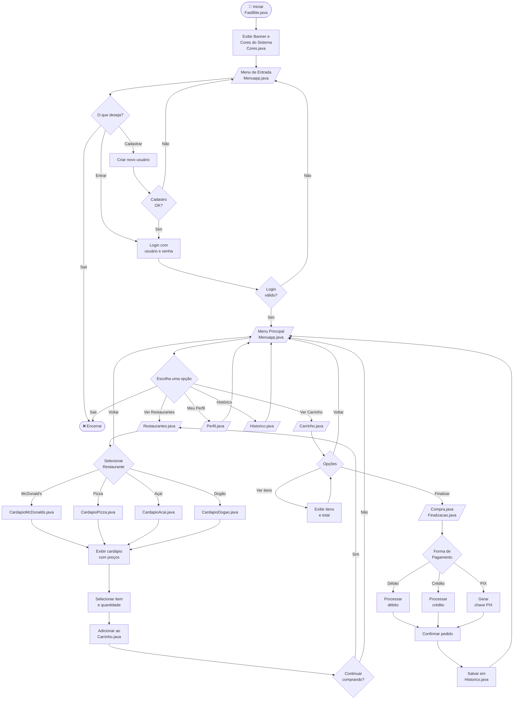

# 🍔 FastBite — Fluxograma Geral do Sistema

---

> **Projeto:** FastBite — Sistema de Pedidos de Fast Food  
> **Linguagem:** Java  
> **Pacotes:** `A_MenuInicial` · `B_Pedido` · `C_Cardapios`  
> **Renderização:** GitHub (Mermaid nativo — sem instalação necessária)
